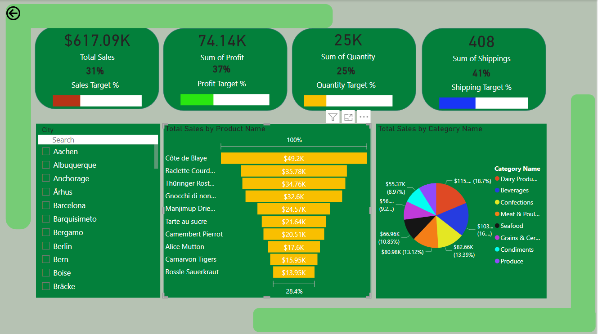
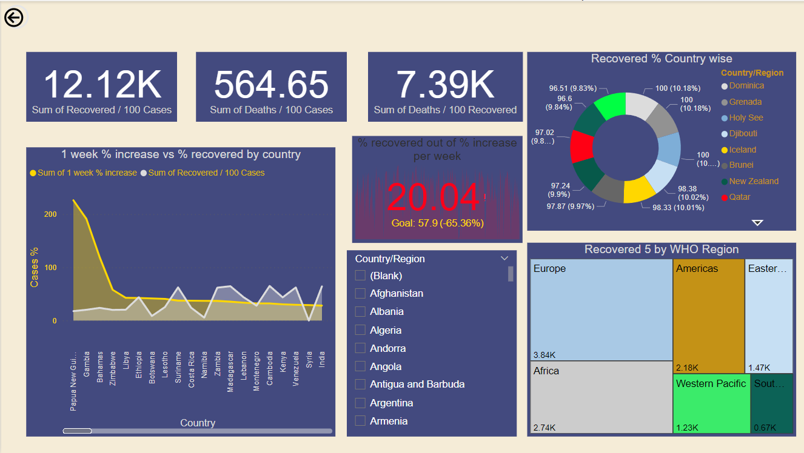
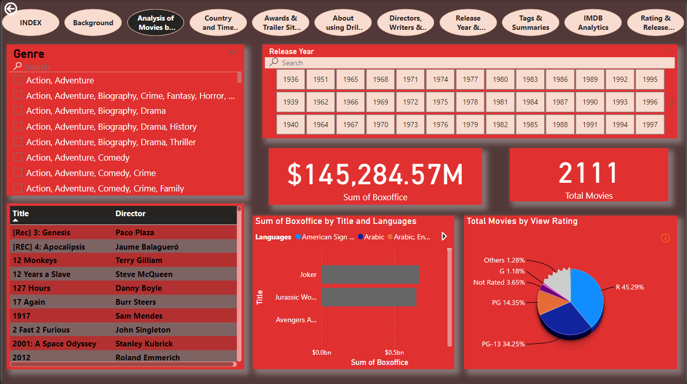
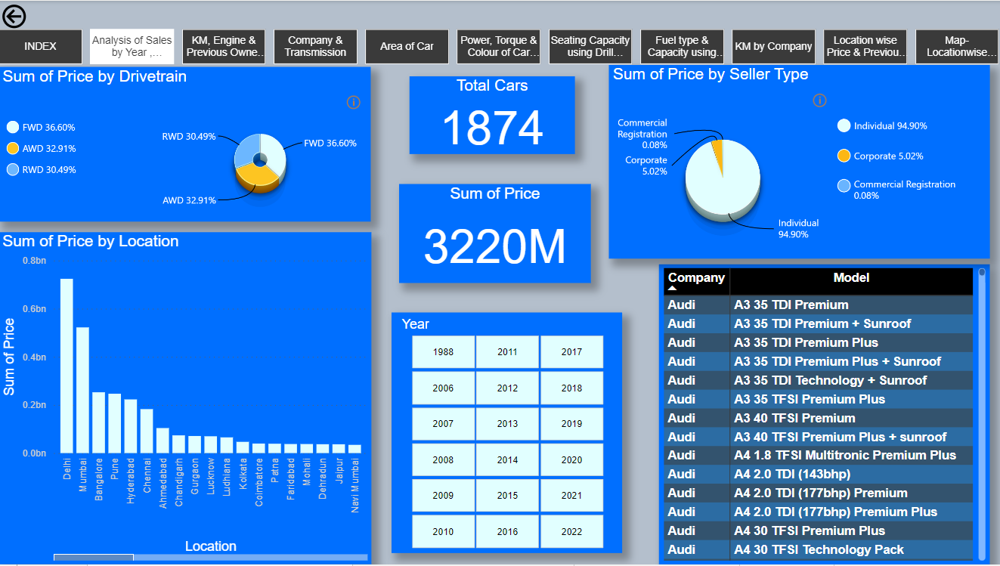

# 📊 Power BI Reports and Dashboards

A collection of interactive **Power BI Reports and Dashboards** created using real-world datasets. This repository demonstrates data cleaning, data modeling, DAX calculations, and dashboard development for business intelligence and data-driven decision making.

---

## 📖 Overview

This repository contains multiple Power BI projects developed during my Data Analytics training. The dashboards are designed to transform raw data into meaningful insights using Power BI's powerful visualization and analytical capabilities.

The projects cover the complete Business Intelligence workflow, including:

- Data Collection
- Data Cleaning
- Data Transformation
- Data Modeling
- DAX Calculations
- Dashboard Design
- Report Publishing
- Business Insights

---

## 📌 Reports vs Dashboards

### 📄 Reports
Reports are collections of visualizations used to analyze and present data. They help users explore datasets, identify trends, and generate actionable business insights.

### 📈 Dashboards
Dashboards are interactive pages containing multiple visualizations that monitor Key Performance Indicators (KPIs). They provide a real-time overview of business performance and support data-driven decision-making.

---

# ⚙️ Power BI Concepts Used

### Data Preparation

- Importing data from multiple sources
- Data Cleaning
- Handling Missing Values
- Changing Data Types
- Promoting Headers
- Creating Supporting Columns

### Data Modeling

- Creating Relationships
- Managing Cardinality
- Configuring Cross Filter Direction
- Building Star Schema Models

### DAX

Examples include:

- Profit Calculation
- Profit Percentage
- Total Quantity
- Date-based Analysis
- Weekly Sales Analysis
- Custom Measures
- Calculated Columns

### Dashboard Features

- KPI Cards
- Line Charts
- Clustered Bar Charts
- Pie Charts
- Maps
- Tables
- Matrix Visuals
- Slicers
- Drill Down
- Drill Through
- Bookmarks
- Navigation Buttons

---

# 📂 Projects Included

## 🌍 1. Northwind Traders Dashboard

### Dataset
Northwind Traders

### Domain
Retail & Supply Chain

### Key Analysis

- Orders
- Customers
- Employees
- Products
- Suppliers
- Sales Performance

### Skills Applied

- Complex Relationship Modeling
- Advanced DAX
- Business KPI Reporting



---

## 🦠 2. COVID-19 Dashboard

### Dataset
Worldwide COVID-19 Dataset

### Key Analysis

- Total Cases
- Active Cases
- Recoveries
- Death Rate
- Country-wise Analysis
- WHO Region Analysis

### Dashboard Features

- Trend Analysis
- Country Comparison
- KPI Cards
- Interactive Filters

 

---

## 🎬 3. Netflix Dashboard

### Dataset
Netflix Movies & TV Shows Dataset

### Key Analysis

- Genre Distribution
- Top Rated Content
- Release Trends
- Movies vs TV Shows
- Content Ratings

### Dashboard Features

- Interactive Visualizations
- Genre Analysis
- Rating Analysis



---

## 🚗 4. Used Cars Dashboard

### Dataset
Used Cars Dataset

### Key Analysis

- Car Prices
- Fuel Type
- Manufacturing Year
- Company-wise Analysis
- Kilometer Driven
- Ownership Analysis

### Dashboard Features

- Dynamic Filters
- Comparative Analysis
- Trend Visualizations



---

# 📊 Power BI Workflow

The following workflow was followed for every dashboard:

1. Understand the Dataset
2. Clean the Data using Power Query
3. Transform the Data
4. Build Relationships
5. Create Hierarchies
6. Develop DAX Measures
7. Design Interactive Visuals
8. Create Reports
9. Publish Reports to Power BI Service
10. Build Dashboards

---

# 💻 Tools & Technologies

- Microsoft Power BI
- Power Query
- Power Pivot
- DAX (Data Analysis Expressions)
- Power BI Service
- Microsoft Excel

---

# 📁 Repository Structure

```
PowerBI-Dashboards/
│
├── Northwind Dashboard/
├── COVID-19 Dashboard/
├── Netflix Dashboard/
├── Used Cars Dashboard/
└── README.md
```

